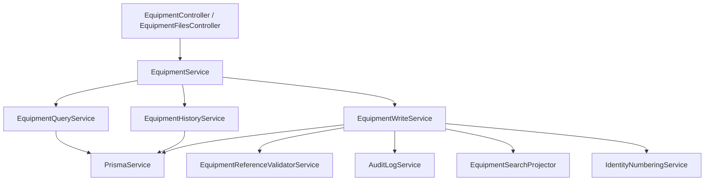

# Equipment Module

Модуль `Equipment` отвечает за управление реестром оборудования предприятия.

## Возможности

- реестр оборудования;
- просмотр карточки оборудования;
- получение справочников, используемых при создании и редактировании оборудования;
- создание оборудования;
- редактирование оборудования;
- просмотр истории изменений оборудования;
- регистрация действий в журнале аудита;
- обновление поискового индекса после изменений;
- хранение и загрузка файлов оборудования.

## Что не входит в модуль

- планирование и выполнение событий оборудования;
- поиск оборудования;
- настройки обслуживания модели оборудования;
- чек-листы и workflow работ;
- уведомления.

Эти сценарии находятся в соседних модулях и используют `Equipment` как источник данных об оборудовании.

## Основные сущности

Модуль управляет следующими основными сущностями:

- `Equipment` — единица оборудования с видимым номером, инвентарным номером, статусом, моделью, местоположением и ответственным.
- `Manufacturer` — производитель оборудования.
- `EquipmentModel` — модель оборудования, принадлежащая производителю.
- `Employee` — сотрудник, который может быть ответственным за оборудование.
- `Section` — участок или подразделение, в котором находится оборудование.
- `Country` — страна производства оборудования.

## Архитектура

## Документация

- [Архитектура](./docs/architecture.md)
- [API](./docs/api.md)
- [Бизнес-правила](./docs/business-rules.md)
- [Модель данных](./docs/data-model.md)
- [Правила разработки](./docs/development.md)
