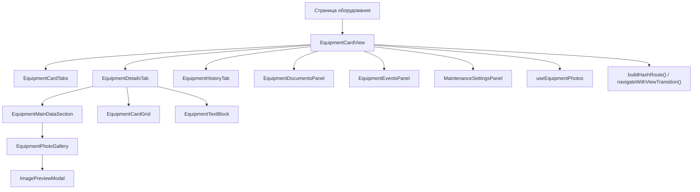

# Архитектура

## Назначение модуля

Модуль `equipment-card` показывает карточку одного оборудования внутри frontend-приложения.

Он не загружает саму карточку с backend и не управляет роутингом страницы целиком. На вход он получает уже загруженные данные оборудования, историю изменений и флаги доступа, а затем:

- управляет активной вкладкой;
- показывает соответствующую панель;
- синхронизирует вкладку с hash-маршрутом;
- загружает фотографии только для вкладки `details`;
- делегирует документы, события и настройки обслуживания вложенным модулям.

## Общая структура

Главный контейнер модуля:

- `EquipmentCardView`

Внутри него используются:

- `EquipmentCardTabs` для переключения вкладок;
- `EquipmentDetailsTab` для основной карточки;
- `EquipmentHistoryTab` для истории;
- `EquipmentDocumentsPanel` для документов;
- `EquipmentEventsPanel` для событий;
- `MaintenanceSettingsPanel` для настроек обслуживания.

Фотографии обслуживаются отдельной связкой:

- `useEquipmentPhotos`
- `EquipmentPhotoGallery`
- `ImagePreviewModal`

Преобразование данных для визуального слоя вынесено в:

- `equipment-card-view-model.tsx`

Локальная навигация вынесена в:

- `equipment-card-tabs.ts`
- `equipment-card-navigation.ts`

## Схема взаимодействия

## Архитектурные принципы

- Модуль не использует глобальное состояние.
- Вся локальная навигация живёт внутри `EquipmentCardView`.
- Активная вкладка хранится в локальном `useState`.
- Фотографии загружаются лениво только для вкладки `details`.
- Остальные вкладки не монтируются одновременно: рендерится только активная панель.
- Вкладки и панели связаны через ARIA-атрибуты, а не через CSS-логику.
- Полноэкранный просмотр фотографии вынесен в общий UI-компонент.

## Границы модуля

Модуль отвечает только за просмотр и навигацию внутри карточки.

Он не отвечает за:

- получение `EquipmentCard` и `EquipmentHistoryItem[]` из API;
- редактирование карточки;
- бизнес-логику документов, событий и maintenance settings;
- авторизацию пользователя.
