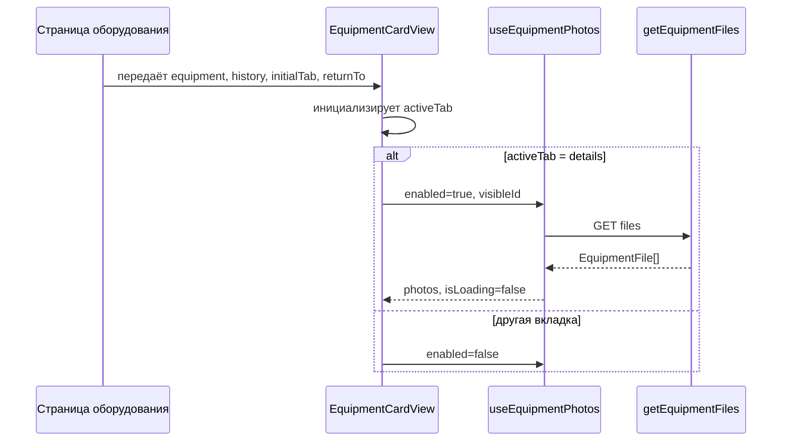
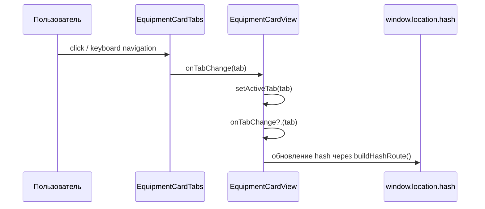
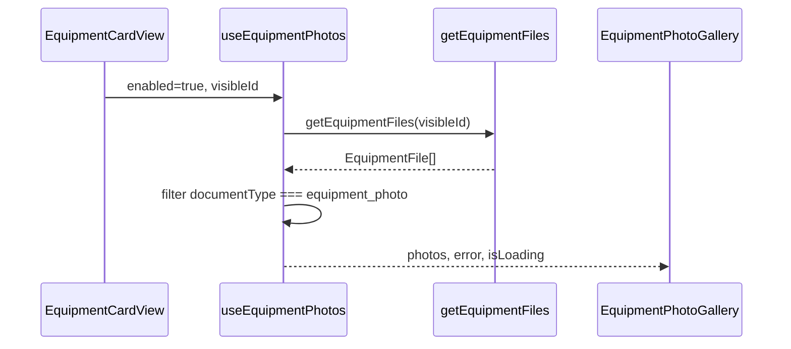
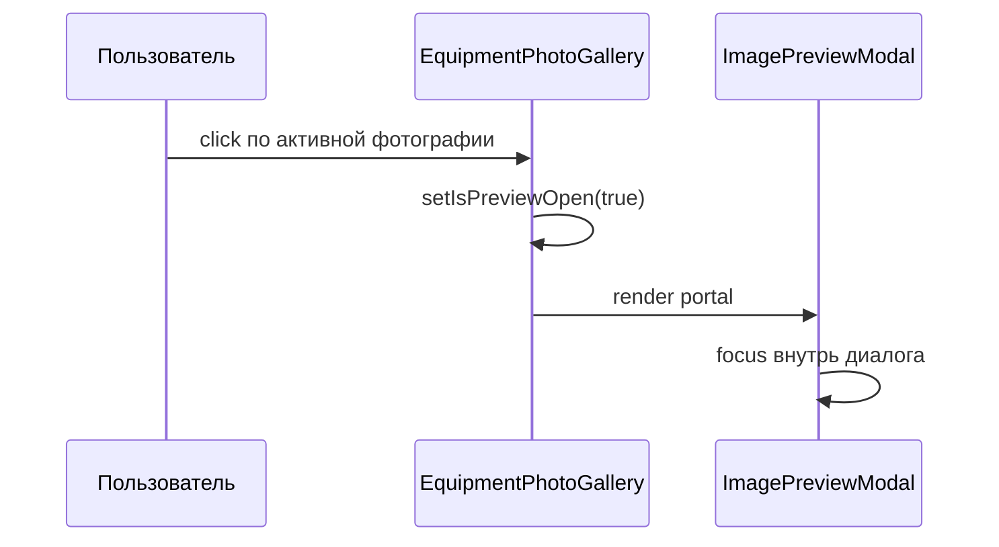
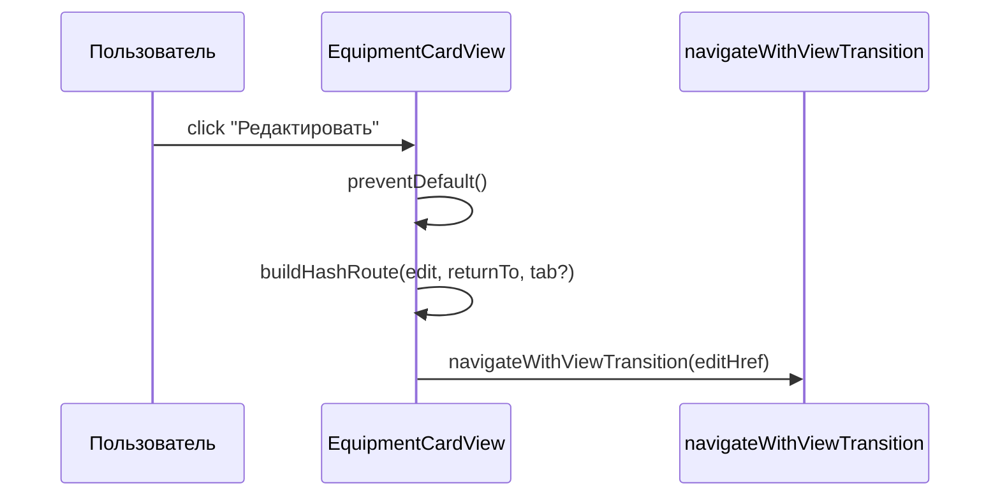

# Последовательности

## Открытие карточки

## Переключение вкладок

## Загрузка фотографий

## Открытие полноэкранного просмотра

## Переход в редактирование

## Возврат назад

Возврат назад выполняется не самим модулем карточки, а внешним роутингом страницы через сохранённый параметр:

- `returnTo`

Карточка только сохраняет это значение при:

- переходе между вкладками
- переходе в редактирование
